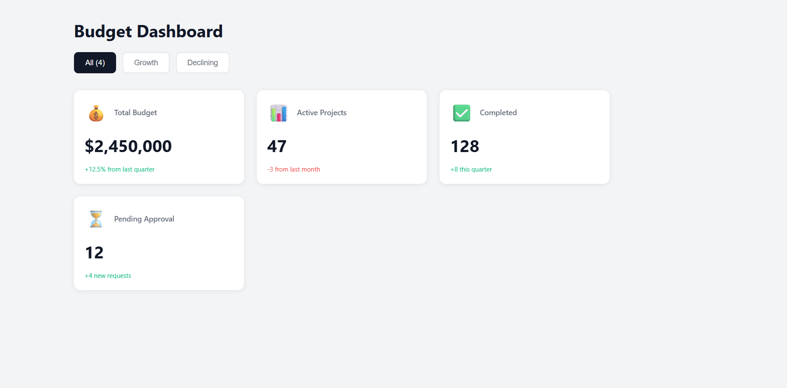
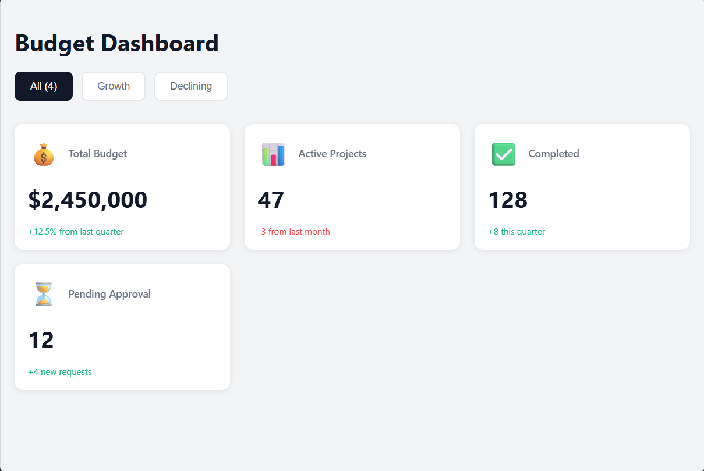
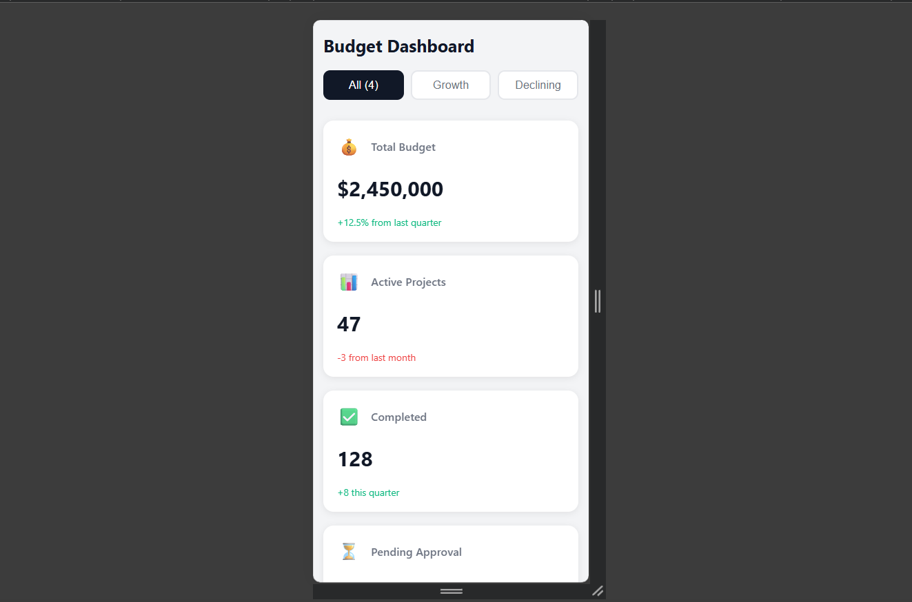
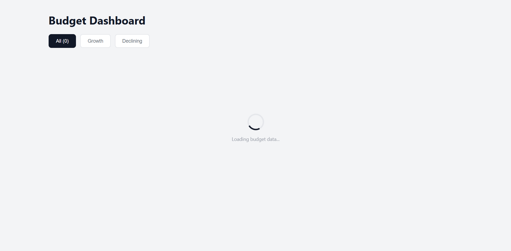
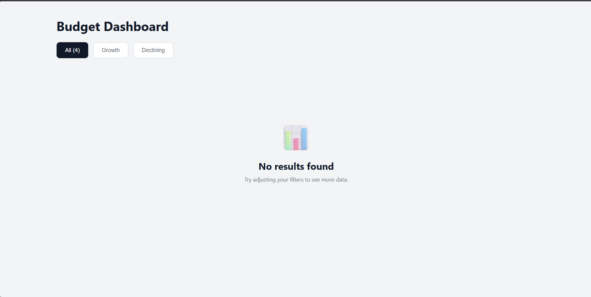

# 💰 Budget Dashboard

A responsive React dashboard for visualizing public investment budget data, built as a demonstration of converting Figma designs into production-quality code.

🔗 **[Live Demo](https://vanna-gio.github.io/budget-dashboard/)** | 📂 **[GitHub Repo](https://github.com/Vanna-Gio/budget-dashboard)**



## 🎯 Project Purpose

This project was created to demonstrate key frontend development skills required for the **General Department of Digital Economy** position, specifically:

- Converting Figma designs into high-quality, pixel-perfect code
- Building responsive interfaces that work across all devices
- Implementing modern React patterns and best practices
- Creating reusable, maintainable component architecture

## ✨ Features

- **📊 Dynamic Data Visualization** - Budget statistics displayed in interactive cards
- **🔍 Filter Functionality** - Toggle between all projects, growing, and declining budgets
- **📱 Fully Responsive** - Optimized for mobile, tablet, and desktop (320px - 1920px+)
- **⚡ Smooth Animations** - Professional fade-in effects with staggered delays
- **🎨 Design System** - CSS variables for consistent theming
- **♿ Accessible** - Semantic HTML and ARIA-friendly components
- **🔄 Loading States** - Simulates real API data fetching
- **📭 Empty States** - Handles edge cases gracefully

## 🛠️ Technologies Used

- **React 18** - UI library
- **JavaScript (ES6+)** - Modern syntax with hooks
- **CSS3** - Custom properties, animations, Grid, Flexbox
- **PropTypes** - Runtime type checking
- **Git** - Version control with conventional commits

## 📱 Responsive Breakpoints
```css
Mobile:     320px - 768px
Tablet:     768px - 968px
Desktop:    968px+
```

## 🚀 Getting Started

### Prerequisites

- Node.js (v14 or higher)
- npm or yarn

### Installation

1. Clone the repository
```bash
git clone https://github.com/Vanna-Gio/budget-dashboard.git
cd budget-dashboard
```

2. Install dependencies
```bash
npm install
```

3. Start development server
```bash
npm start
```

4. Open [http://localhost:3000](http://localhost:3000) in your browser

## 📂 Project Structure
```
src/
├── components/
│   ├── BudgetCard/          # Main card component
│   │   ├── BudgetCard.jsx
│   │   ├── BudgetCard.css
│   │   └── index.js
│   ├── LoadingSpinner/      # Loading state component
│   └── EmptyState/          # Empty state component
├── data/
│   └── mockData.js          # Simulated API data
├── App.js                   # Main application logic
└── App.css                  # Global styles
```

## 🎨 Design Decisions

### Component Architecture
- **Atomic Design** - Small, reusable components
- **Single Responsibility** - Each component has one job
- **Props-driven** - Data flows from parent to child

### Animation Strategy
- **CSS Variables** - Dynamic animation delays scale infinitely
- **Performance** - GPU-accelerated transforms (translateY)
- **UX Focus** - Subtle animations enhance, don't distract

### Responsive Approach
- **Desktop-first** - Started with 320px Figma design
- **CSS Grid** - Auto-fit for flexible layouts
- **Mobile optimization** - Touch-friendly buttons, readable text

## 📸 Screenshots

### Desktop View


### Mobile View


### Loading State


### Empty State


## 🧪 What I Learned

### Technical Skills
- Converting Figma design tokens (spacing, colors, typography) to CSS
- Implementing CSS custom properties for dynamic animations
- React Hooks: `useState`, `useEffect`
- Array methods: `.map()`, `.filter()`
- Conditional rendering patterns
- PropTypes validation

### Professional Practices
- Conventional commit messages
- Component extraction and refactoring
- Barrel exports for clean imports
- Separation of concerns (data, logic, UI)
- Edge case handling (loading, empty, error states)

### Design Principles
- Mobile-first thinking (even with desktop-first implementation)
- Accessibility considerations
- Consistent spacing and visual hierarchy
- Smooth micro-interactions

## 🚧 Future Enhancements

- [ ] Connect to real REST API
- [ ] Add search functionality
- [ ] Implement sorting options
- [ ] Dark mode toggle
- [ ] Export data to CSV/PDF
- [ ] Unit tests with Jest/React Testing Library
- [ ] Accessibility audit with axe-core
- [ ] Performance optimization with React.memo

## 📄 License

This project is open source and available under the [MIT License](LICENSE).

## 👤 Author

**Your Name**
- GitHub: [@Vanna-Gio](https://github.com/Vanna-Gio)
- LinkedIn: [Sovanna Ra](https://linkedin.com/in/sovanna-ra-866504347/)
- Portfolio: [sovanna-portfolio.com](https://sovanna-portfolio.vercel.app/)

## 🙏 Acknowledgments

- Design inspiration from modern dashboard interfaces
- Built for the General Department of Digital Economy job application
- Project guidance and mentorship throughout development

---

⭐ If this project helped you learn React, please consider giving it a star!